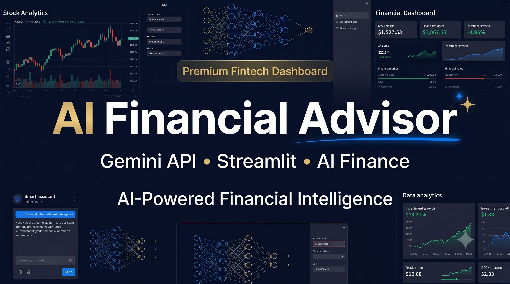

# 💰 AI Financial Advisor Pro

AI-powered financial planning platform featuring financial health scoring, risk profiling, goal planning, AI-generated recommendations, savings forecasting, interactive analytics, and PDF report generation.

---

## 🚀 Features

### 📊 Financial Dashboard
- Financial Health Score (0–100)
- Financial Grade (A–D)
- Risk Profile Analysis
- Expense Ratio Analysis
- Emergency Fund Tracking
- Debt-to-Income Ratio Calculation

### 🎯 Goal Planning
- Goal Progress Tracking
- Months-to-Goal Estimation
- Savings Recommendations
- Budget Analysis

### 📈 Interactive Visualizations
- Expense Breakdown Charts
- Income vs Expenses vs Savings
- Financial Insights Dashboard
- Savings Forecasting

### 🤖 AI Financial Coach
- Personalized Financial Advice
- Investment Suggestions
- Goal Achievement Strategies
- Risk Awareness Guidance
- AI Financial Q&A Assistant

### 📄 Financial Reports
- Downloadable PDF Reports
- Personalized Financial Summary
- Key Financial Metrics

---

## 🛠 Tech Stack

### Frontend
- Streamlit

### Backend
- Python

### AI
- OpenRouter
- DeepSeek Chat V3

### Data & Visualization
- Pandas
- Plotly

### Reports
- ReportLab

### Environment Management
- Python Dotenv

---

## 📷 Screenshots

### Dashboard Overview


### AI Financial Coach


### Goal Planner


---

## ⚙️ Installation

Clone the repository:

```bash
git clone https://github.com/vaikunthprajapati/ai-financial-advisor.git
cd ai-financial-advisor
```

Install dependencies:

```bash
pip install -r requirements.txt
```

Create a `.env` file:

```env
OPENROUTER_API_KEY=your_api_key_here
```

Run the application:

```bash
streamlit run app.py
```

---

## 📁 Project Structure

```text
ai-financial-advisor/
│
├── app.py
├── requirements.txt
├── .env.example
├── README.md
├── screenshots/
└── .gitignore
```

---

## 🎯 Resume Description

Built an AI-powered financial planning dashboard using Python, Streamlit, OpenRouter, DeepSeek, Plotly, and ReportLab.

Implemented:
- Financial Health Scoring
- Risk Profiling
- Goal Planning
- Savings Forecasting
- AI-Powered Recommendations
- PDF Report Generation
- Interactive Financial Visualizations

---

## 🔮 Future Improvements

- Portfolio Analysis
- Investment Allocation Engine
- Expense Categorization AI
- Retirement Planning Module
- Multi-user Authentication
- Cloud Database Integration

---

## 👨‍💻 Author

**Vaikunth Prajapati**

GitHub: https://github.com/vaikunthprajapati
